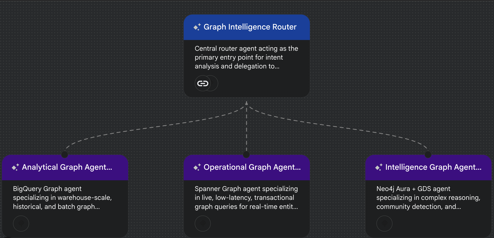
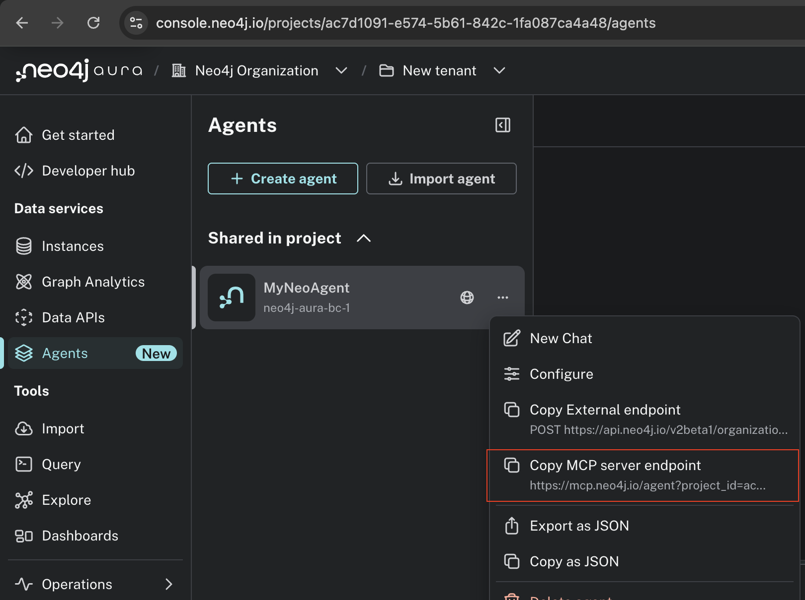
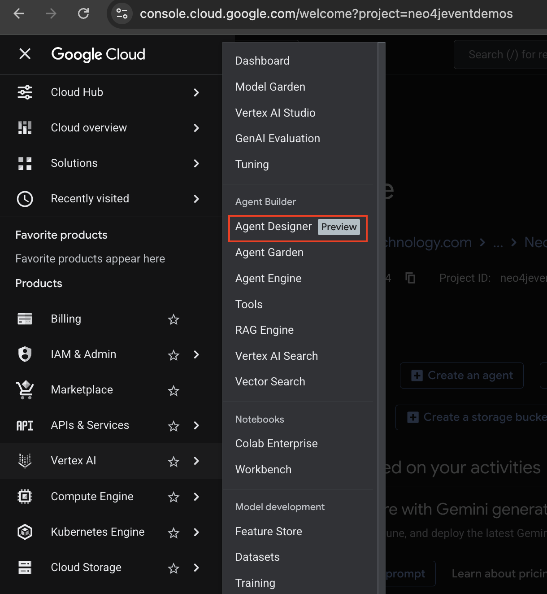
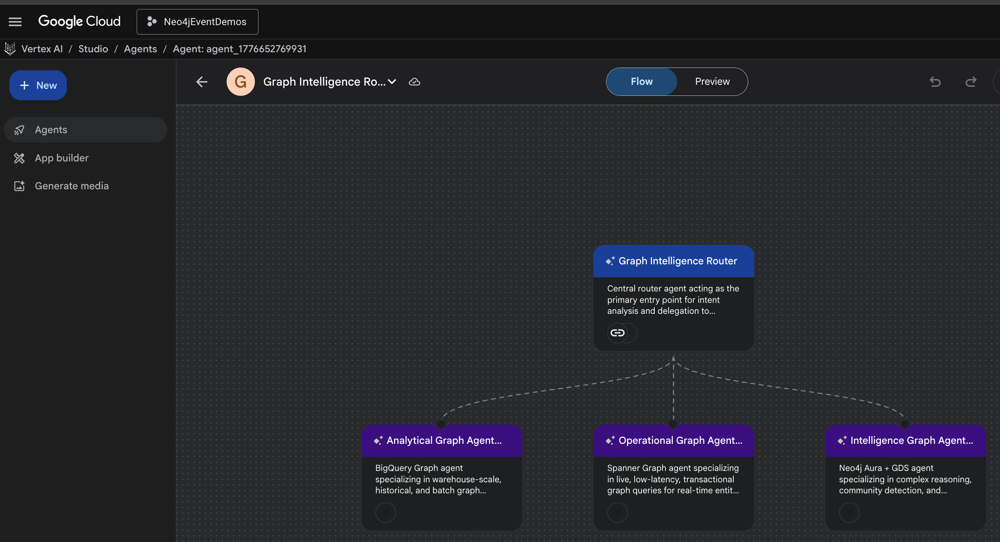

# MultiGraph Intel

A production-grade reference architecture for a **multi-agent graph intelligence system on Google Cloud**, built around Vertex AI Agent Builder and three specialized graph substrates: **BigQuery FraudGraph**, **Spanner FinGraph**, and **Neo4j Aura with Graph Data Science**.

The system demonstrates how a single natural-language question can be routed to the right graph engine for the job, then synthesized into a single, cited answer for the analyst.

## Why this exists

Real fraud and financial-crime investigations are never served by a single data store. Warehouse-scale history lives in BigQuery. Sub-second account state lives in Spanner. Reasoning, community detection, analyst memory, and graph algorithms live in Neo4j. Forcing analysts to pick the right query tool for each question is a bad experience and it slows investigations down.

This repository shows how to let the analyst ask the question in plain English and have a router agent delegate the query to the substrate that can answer it best, then cite the source back in the response.

## Architecture at a glance



The design is a classic **Coordinator and Dispatcher** pattern on top of Vertex AI Agent Builder:

- **Graph Intelligence Router** (root agent) performs intent analysis and delegates using `transfer_to_agent`.
- **Analytical Graph Agent** answers warehouse-scale and historical questions against BigQuery FraudGraph.
- **Operational Graph Agent** answers live, transactional questions against Spanner FinGraph.
- **Intelligence Graph Agent** answers reasoning, algorithm, and memory questions against Neo4j Aura plus GDS.

All three subagents are peers under the A2A v1.0 protocol. The router narrates which subagent handled the query and which graph substrate the answer came from, so every response is attributable.

### Substrate decision matrix

| Factor            | Analytical (BigQuery)        | Operational (Spanner)       | Intelligence (Neo4j Aura + GDS) |
| ----------------- | ---------------------------- | --------------------------- | ------------------------------- |
| Latency           | Higher, warehouse scan       | Low, transactional          | Moderate, reasoning and algo    |
| Scale             | Petabyte class                | Horizontal and global       | High, memory and GDS            |
| Query language    | GQL over SQL tables           | Native GQL                  | Cypher via MCP                  |
| Primary use case  | Historical patterns           | Live transactions           | Reasoning, communities, memory  |
| Example question  | Top five fraud cards          | Is account 101 active now   | Which ring does Alice belong to |

## Repository layout

```
.
├── analytical_shim/        # Cloud Run service exposing BigQuery FraudGraph tools to the agent
├── operational_shim/       # Cloud Run service exposing Spanner FinGraph GQL tools to the agent
├── intelligence_shim/      # Cloud Run FastMCP server wrapping Neo4j Aura (schema + Cypher + GDS)
├── infra/                  # Terraform for APIs, service account, IAM, and Secret Manager entries
├── prompts/                # Versioned prompts used to design and evolve the system
├── docs/images/            # Tool-level configuration screenshots referenced inline in other docs
├── screenshots/            # Canvas and console screenshots used by this README
├── agent_instructions.md   # Final system instructions for the router and three subagents
├── initial_design.md       # Architectural foundation and tradeoffs
├── deployment_guide.md     # Step-by-step deployment on GCP
├── demo_questions.md       # Validated demo script with expected answers
├── neo4j_load.cypher       # Seed data for the enriched Neo4j model (Person, Account, Card, Case, rings)
├── spanner_graph_setup.sql # DDL for the Spanner FinGraph property graph
├── sample_data_setup.sql   # Seed rows for Spanner tables
├── sample_data_ingestion.sql # Supporting ingestion statements
├── neo4j_agent_config.json # Intelligence agent tool configuration
└── demo_app_config.json    # Front-end dashboard configuration
```

## The three subagents in detail

### Analytical Graph Agent (BigQuery FraudGraph)

Backed by `bigquery-public-data.ml_datasets.ulb_fraud_detection` modeled as a `FraudGraph` (Card, Transaction, `PERFORMED`). The `analytical_shim/` service exposes:

- `describe_schema` returns the FraudGraph schema and edge definitions.
- `run_sql` runs read-only SQL, including `GRAPH_TABLE` calls for graph-native pattern matching.
- `AI.DETECT_ANOMALIES` and other BigQuery ML functions are available for outlier detection and forecasts.

Good fits: top-N fraud cards, fraud prevalence across a dataset, card-type distribution, cross-country aggregation, largest-single-fraud lookups.

### Operational Graph Agent (Spanner FinGraph)

Backed by a Spanner database with a `FinGraph` property graph (Person, Account, Transfer, Card) and an `is_active` flag per account. The `operational_shim/` service exposes:

- `GET /account/{account_id}` for point-lookups.
- `GET /person/{person_id}/network` for immediate ownership traversal.
- `POST /query` for arbitrary GQL, including variable-length paths and ring detection.

Good fits: "Is this account active now", one-hop ownership, multi-hop reach within two hops, three-hop ring detection, live inactive-account lists.

### Intelligence Graph Agent (Neo4j Aura plus GDS)

Backed by Neo4j Aura with an enriched model that Spanner and BigQuery do not hold:

- `community_id`, `pagerank_score`, and `fraud_score` on `Account`.
- `Case` nodes with analyst memory (who opened it, what action was recommended, when).
- `SUSPECTED_LAUNDERING_RING` relationships pre-computed from transfer chains.
- `LINKED_TO_CARD` bridges into the BigQuery FraudGraph card space.

The `intelligence_shim/` service is a FastMCP server that wraps the official Neo4j Python driver and exposes two tools to the LLM:

- `describe_schema` returns the authoritative, type-annotated schema and the GDS workflow idioms, so the model writes accurate Cypher on the first try.
- `run_cypher` executes read-only Cypher. Mutating keywords are rejected at the shim boundary, but GDS `project`, `stream`, `stats`, and `mutate` procedures are permitted so Louvain, PageRank, and WCC can run.

There is also a `bloom_deeplink(entity_type, entity_id)` tool that returns a deep link into Neo4j Bloom and the Aura Console Explore tool, so the analyst can jump from a chat answer into a visual graph forensics session with the right database preselected.

Good fits: Entity 360 briefings, PageRank or Louvain on the transfer network, ring financial impact, cross-substrate risk narratives, visual exploration hand-off.

#### Hosted Aura MCP vs custom shim

There are two valid ways to satisfy the Intelligence agent's tool requirement:

- **Option A**: use Neo4j Aura's hosted MCP agent. Paste the generated MCP URL into the Vertex AI tool configuration. Zero infrastructure to own. Faster to start, less control over schema hints.
- **Option B (what this repo deploys)**: deploy `intelligence_shim/` to Cloud Run. More control, schema-aware descriptions, and a reviewable security boundary for write rejection. Slightly more infrastructure to own.

The demo in this repository uses Option B because the enriched model, analyst memory, and cross-substrate card bridges benefit from structured schema hints.

To copy the hosted MCP endpoint from the Neo4j Aura console for Option A:



## Deploying the system

### Prerequisites

- A GCP project with billing enabled. The reference project is `neo4jeventdemos`.
- Neo4j Aura instance with GDS enabled, reachable from Cloud Run.
- `gcloud`, `terraform`, and `docker` installed locally.

### 1. Provision the platform

```bash
cd infra
terraform init
terraform apply -var project_id=<YOUR_PROJECT_ID>
```

This enables the required APIs (`aiplatform`, `bigquery`, `spanner`, `secretmanager`, `dataflow`, `iam`, `compute`), creates the `graph-intel-sa` service account with least-privilege roles, and provisions the Secret Manager entries the Intelligence agent depends on.

### 2. Populate secrets

```bash
gcloud secrets versions add neo4j-uri      --data-file=-   # Aura connection URI
gcloud secrets versions add neo4j-username --data-file=-   # DB user
gcloud secrets versions add neo4j-password --data-file=-   # DB password
gcloud secrets versions add mcp-endpoint   --data-file=-   # Unified MCP endpoint URL
gcloud secrets versions add mcp-client-id     --data-file=-
gcloud secrets versions add mcp-client-secret --data-file=-
```

### 3. Seed the graph substrates

- **Spanner FinGraph**: apply `spanner_graph_setup.sql` (DDL) followed by `sample_data_setup.sql` and `sample_data_ingestion.sql`.
- **BigQuery FraudGraph**: query the `ulb_fraud_detection` public dataset directly. No ingestion required.
- **Neo4j Aura**: run `neo4j_load.cypher` to load the enriched model (Person, Account with enrichment columns, Card, Case with analyst memory, `SUSPECTED_LAUNDERING_RING`, `LINKED_TO_CARD`).

### 4. Deploy the Cloud Run shims

Each of `analytical_shim/`, `operational_shim/`, and `intelligence_shim/` has its own `Dockerfile`. Build and deploy each one to Cloud Run, running as the `graph-intel-sa` service account. The Intelligence shim reads Aura credentials from Secret Manager at startup.

```bash
# example for the intelligence shim
gcloud run deploy intelligence-graph-shim \
  --source intelligence_shim/ \
  --region us-central1 \
  --service-account graph-intel-sa@<PROJECT_ID>.iam.gserviceaccount.com \
  --set-secrets NEO4J_URI=neo4j-uri:latest,NEO4J_USERNAME=neo4j-username:latest,NEO4J_PASSWORD=neo4j-password:latest
```

### 5. Configure the agents in Vertex AI Agent Builder

In the GCP console, navigate to Vertex AI and open **Agent Designer**.



Create the four agents using the exact system instructions in `agent_instructions.md`:

- `graph-intelligence-router` with `transfer_to_agent` to each subagent.
- `analytical_graph_agent` with the Analytical shim wired as an OpenAPI tool.
- `operational_graph_agent` with the Operational shim wired as an OpenAPI tool.
- `intelligence_graph_agent` with the Neo4j MCP endpoint wired as the MCP tool.

The canvas should look like this once the router is linked to all three subagents:



### 6. Run the demo

Open the **Preview** tab on the router and run the validated questions in `demo_questions.md`. They are grouped by substrate and each question documents the expected tool call and answer shape, so the demo is reproducible and reviewable.

## Security and IAM

Security is treated as a first-class requirement, not a demo afterthought.

- **Single service identity**: all agents and all Cloud Run shims run as `graph-intel-sa`, so every data access is attributable to one identity and one audit trail.
- **Least-privilege roles**: `roles/bigquery.dataViewer` and `roles/bigquery.jobUser` for analytical workloads, `roles/spanner.databaseUser` for operational workloads, `roles/secretmanager.secretAccessor` for Aura credentials, and `roles/aiplatform.user` for the Vertex AI runtime. No wildcard roles.
- **Secret Manager for credentials**: no Aura URIs, usernames, passwords, or MCP client secrets are stored in code. The shims read them at startup.
- **Write rejection at the shim boundary**: the Intelligence shim rejects mutating Cypher keywords and non-GDS mutating procedures before they reach the driver. The Operational shim exposes only the three shapes the agent needs, not raw DML.
- **Demo auth caveat**: the current demo uses unauthenticated MCP because of a Vertex AI Studio Preview limitation around OAuth and API Keys for MCP tools. Before any non-demo use, put IAP or OIDC in front of the shims and switch the MCP tool to an authenticated configuration.

## Trade-offs and design choices

- **Router on Gemini**: a single root agent is simpler to reason about than a hub of narrow tools. The cost is one extra hop per question. In exchange the router provides intent analysis, clarification, and cited synthesis.
- **Shims instead of raw tools**: wrapping each substrate in a Cloud Run shim gives a reviewable authorization boundary, typed tool descriptions for the LLM, and a single place to add observability. It costs one more deployable service per substrate.
- **Enrichment lives in Neo4j**: `community_id`, `pagerank_score`, `fraud_score`, case memory, and ring topology are written to Neo4j by a Dataflow job, then surfaced back to BigQuery as BI columns through a reverse ETL. This keeps reasoning-heavy analytics in a graph-native store and keeps BigQuery the system of record for warehouse analytics.
- **MCP for Neo4j only**: MCP is used where it adds the most value, which is exposing deep graph operations and memory state to the LLM. Spanner and BigQuery are served by plain OpenAPI shims because their tool surfaces are narrower.

## Prompt and decision transparency

Prompts used to design and iterate this system are preserved in `prompts/` so the evolution of the architecture is reviewable. `initial_design.md` captures the architectural foundation, `agent_instructions.md` captures the final system instructions, and `demo_questions.md` captures the validated demo script with expected answers. Anyone reviewing the repo should be able to reconstruct how the solution was reasoned through, not just what was shipped.

## Further reading

- `initial_design.md` for the architectural foundation and tradeoffs.
- `agent_instructions.md` for the full system instructions for every agent.
- `deployment_guide.md` for the step-by-step deployment walkthrough.
- `demo_questions.md` for the validated demo script grouped by substrate.
