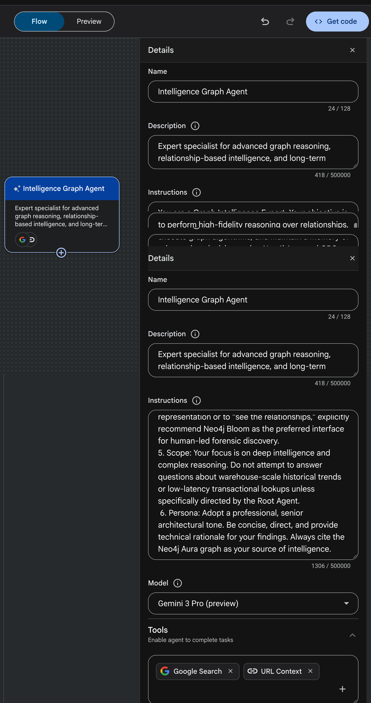
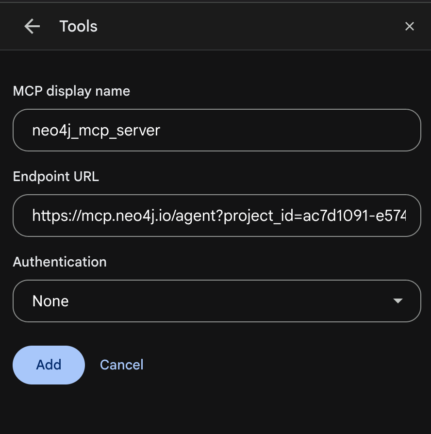

# MultiGraph Intel

A weekend-style experiment to learn what is new in **Google Cloud Vertex AI Agent Builder**, put together ahead of the **Google Next** event. The goal is to get hands-on with the Agent Designer canvas, the A2A peer protocol, and the MCP and OpenAPI tool types, using graph questions as the workload so the multi-agent routing story has something realistic to do.

Three graph engines on GCP are wired behind one root agent as complementary tool backends:

- **BigQuery with GQL**
- **Spanner Graph**
- **Neo4j Aura with Graph Data Science**

This repo is an exploration, not a benchmark. Each of those engines can cover a wider surface than the role assigned to it here; the scoping choices were made to keep the demo crisp and the routing story easy to follow.

## What this is, and what this is not

- **This is** a walkthrough of how to build, wire, and demo a coordinator-and-dispatcher multi-agent system on Vertex AI Agent Builder, using three Google Cloud graph services behind it.
- **This is not** a benchmark or a statement that any one graph engine is better than another. BigQuery GQL, Spanner Graph, and Neo4j Aura plus GDS are each fully capable graph platforms. The choice of which question lands on which substrate here is a demo-design choice, not a claim about capability limits.
- **This is not** a polished, finished artifact. It is a sandbox for trying out what Agent Builder ships with this week, and what MCP and A2A look like in practice.

## Finding Agent Designer in the console

Agent Designer lives inside Vertex AI in the Cloud Console.


Once inside, the Flow and Preview tabs are where most of the experiment happens.

## Architecture at a glance


The design follows the **Coordinator and Dispatcher** pattern inside Vertex AI Agent Builder:

- **Graph Intelligence Router** (root agent) performs intent analysis and delegates using `transfer_to_agent`.
- **Analytical Graph Agent** uses the BigQuery GQL and BigQuery ML surface for warehouse-scale historical analytics.
- **Operational Graph Agent** uses Spanner Graph for live, transactional graph workloads.
- **Intelligence Graph Agent** uses Neo4j Aura plus Graph Data Science for algorithm-driven reasoning and analyst memory.

All three subagents are A2A v1.0 peers. The router narrates which subagent handled the query and which substrate produced the answer, so every response stays attributable.

Here is the full Agent Designer canvas once the router is linked to the three subagents:


### Why three substrates in one experiment

A single multi-agent system is more interesting to explore when the tools behind it have different shapes. Picking three graph engines that each have their own natural home lets the router actually do intent analysis rather than always routing to the same tool.

- **BigQuery with GQL** is a good fit for petabyte-scale historical scans and for blending graph patterns with BigQuery ML functions that already live in the warehouse.
- **Spanner Graph** is a good fit for sub-second transactional lookups and low-latency GQL traversals, including multi-hop and cyclic patterns, on live data. Spanner Graph can express a much broader surface than the handful of tool shapes we route to it in this experiment; we kept its agent tool narrow on purpose so the router's intent-analysis story stays readable.
- **Neo4j Aura plus GDS** is a good fit for the parts of the demo that lean on pre-built graph algorithms (PageRank, Louvain, WCC, link prediction), memory of prior analyst decisions, and a Cypher-centric exploration tool like Bloom.

The point of the experiment is **the routing and the Agent Builder experience**, not a ranking of the engines.

### Substrate responsibility in this demo

| Factor in this demo | Analytical (BigQuery)           | Operational (Spanner Graph)    | Intelligence (Neo4j Aura + GDS) |
| ------------------- | ------------------------------- | ------------------------------ | ------------------------------- |
| Typical question    | Historical aggregates           | Live transactional state       | Algorithm-driven reasoning      |
| Tool protocol       | OpenAPI shim over BigQuery GQL  | OpenAPI shim over Spanner GQL  | MCP over Cypher and GDS         |
| Example ask         | Top five fraud cards            | Is account 101 active now      | PageRank on the transfer network |
| Why it sits here    | Warehouse ML functions nearby   | Sub-second live GQL            | Native GDS procedures and MCP   |

This table describes the demo layout, not capability limits. Spanner Graph, BigQuery GQL, and Neo4j Aura can each cover a wider surface than what they are assigned here, and any of them can be extended to cover more of the intent space in a real deployment.

## Repository layout

```
.
├── analytical_shim/        # Cloud Run service exposing BigQuery GQL tools to the Analytical agent
├── operational_shim/       # Cloud Run service exposing Spanner Graph GQL tools to the Operational agent
├── intelligence_shim/      # Cloud Run FastMCP server wrapping Neo4j Aura (schema + Cypher + GDS)
├── infra/                  # Terraform for APIs, service account, IAM, and Secret Manager entries
├── prompts/                # Versioned prompts used to design and evolve the system
├── docs/images/            # Tool-level configuration screenshots referenced inline in other docs
├── screenshots/            # Canvas and console screenshots used by this README
├── agent_instructions.md   # Final system instructions for the router and three subagents
├── initial_design.md       # Architectural foundation and tradeoffs
├── deployment_guide.md     # Step-by-step deployment on GCP
├── demo_questions.md       # Validated demo script with expected answers
├── neo4j_load.cypher       # Seed data for the Neo4j demo model
├── spanner_graph_setup.sql # DDL for the Spanner Graph property graph
├── sample_data_setup.sql   # Seed rows for Spanner tables
├── sample_data_ingestion.sql # Supporting ingestion statements
├── neo4j_agent_config.json # Intelligence agent tool configuration
└── demo_app_config.json    # Front-end dashboard configuration
```

## The three subagents in detail

### Analytical Graph Agent (BigQuery GQL)

Backed by `bigquery-public-data.ml_datasets.ulb_fraud_detection` modeled as a property graph (`Card`, `Transaction`, `PERFORMED`). The `analytical_shim/` service exposes:

- `describe_schema` returns the graph schema and edge definitions.
- `run_sql` runs read-only SQL, including `GRAPH_TABLE` calls for graph-native pattern matching in BigQuery.
- BigQuery ML functions such as `AI.DETECT_ANOMALIES` are available alongside the graph traversals.

In this demo the agent handles top-N fraud cards, fraud prevalence across the dataset, card-type and country distributions, and largest-single-fraud lookups.

### Operational Graph Agent (Spanner Graph)

Backed by a Spanner database with a property graph over `Person`, `Account`, `Transfer`, and `Card`, plus an `is_active` flag per account. The `operational_shim/` service exposes:

- `GET /account/{account_id}` for point-lookups.
- `GET /person/{person_id}/network` for immediate ownership traversal.
- `POST /query` for arbitrary GQL, including variable-length paths and cyclic ring detection.

In this demo the agent handles live account status, one-hop ownership, multi-hop reach within two hops, three-hop ring detection, and live inactive-account lists. Spanner Graph's native GQL surface is much broader than these three tool shapes, including richer analytics patterns. We intentionally limited the tool surface here to keep the agent instructions crisp and the routing story easy to follow.

### Intelligence Graph Agent (Neo4j Aura plus GDS)

Backed by Neo4j Aura, seeded with a small demo model that includes:

- `community_id`, `pagerank_score`, and `fraud_score` enrichment fields on `Account`.
- `Case` nodes carrying demo analyst memory (who opened it, what action was recommended, when).
- `SUSPECTED_LAUNDERING_RING` relationships derived from the transfer topology.
- `LINKED_TO_CARD` bridges that tie the Neo4j accounts to card ids that also appear in the BigQuery dataset, to illustrate a cross-substrate narrative in the router's synthesis step.

The `intelligence_shim/` service is a FastMCP server that wraps the official Neo4j Python driver and exposes two tools to the LLM:

- `describe_schema` returns a type-annotated schema and GDS workflow idioms so the model writes accurate Cypher on the first try.
- `run_cypher` executes read-only Cypher. Mutating keywords are rejected at the shim boundary, while GDS `project`, `stream`, `stats`, and `mutate` procedures are permitted so Louvain, PageRank, and WCC can run.

There is also a `bloom_deeplink(entity_type, entity_id)` tool that returns a deep link into Neo4j Bloom and the Aura Console Explore tool, so a chat answer can hand off into a visual graph exploration session.

In this demo the agent handles entity briefings that blend enrichment fields, GDS algorithms over the transfer network, ring financial impact, and the Bloom hand-off. Similar outcomes can be approximated on other substrates with bespoke code. The agent uses Neo4j Aura here because its native GDS procedures and Bloom integration keep that code minimal for the experiment.

The Intelligence agent configuration in Agent Designer looks like this:



#### Hosted Aura MCP vs custom shim

There are two valid ways to satisfy the Intelligence agent's tool requirement. Both are supported by Vertex AI Agent Builder's MCP tool type.

- **Option A**: use Neo4j Aura's hosted MCP agent. Paste the generated MCP URL into the Vertex AI tool configuration. Zero infrastructure to own, faster to start.
- **Option B (what this repo deploys)**: deploy `intelligence_shim/` to Cloud Run. Slightly more infrastructure, and in return a visible shim boundary and structured schema hints for the LLM.

This experiment uses Option B to keep the schema hints explicit, which helps the router's intent analysis land accurate Cypher on the first try. Option A is a perfectly reasonable starting point for environments where the schema is still evolving.

To copy the hosted MCP endpoint from the Aura console for Option A:


When adding the MCP endpoint as a tool inside Agent Designer, the current Vertex AI Studio Preview uses authentication type **None** for MCP tools:



That caveat is worth flagging up front: before taking this pattern anywhere beyond a demo, put IAP or OIDC in front of the shim and switch the MCP tool to an authenticated configuration.

## Deploying the experiment

### Prerequisites

- A GCP project with billing enabled. The reference project is `neo4jeventdemos`.
- Neo4j Aura instance with GDS enabled, reachable from Cloud Run.
- `gcloud`, `terraform`, and `docker` installed locally.

### 1. Provision the platform

```bash
cd infra
terraform init
terraform apply -var project_id=<YOUR_PROJECT_ID>
```

This enables the required APIs (`aiplatform`, `bigquery`, `spanner`, `secretmanager`, `dataflow`, `iam`, `compute`), creates the `graph-intel-sa` service account with least-privilege roles, and provisions the Secret Manager entries the Intelligence agent depends on.

### 2. Populate secrets

```bash
gcloud secrets versions add neo4j-uri      --data-file=-   # Aura connection URI
gcloud secrets versions add neo4j-username --data-file=-   # DB user
gcloud secrets versions add neo4j-password --data-file=-   # DB password
gcloud secrets versions add mcp-endpoint   --data-file=-   # Unified MCP endpoint URL
gcloud secrets versions add mcp-client-id     --data-file=-
gcloud secrets versions add mcp-client-secret --data-file=-
```

### 3. Seed the graph substrates

- **Spanner Graph**: apply `spanner_graph_setup.sql` (DDL) followed by `sample_data_setup.sql` and `sample_data_ingestion.sql`.
- **BigQuery**: query the `ulb_fraud_detection` public dataset directly. No ingestion required.
- **Neo4j Aura**: run `neo4j_load.cypher` to load the demo model.

### 4. Deploy the Cloud Run shims

Each of `analytical_shim/`, `operational_shim/`, and `intelligence_shim/` has its own `Dockerfile`. Build and deploy each one to Cloud Run, running as the `graph-intel-sa` service account. The Intelligence shim reads Aura credentials from Secret Manager at startup.

```bash
# example for the intelligence shim
gcloud run deploy intelligence-graph-shim \
  --source intelligence_shim/ \
  --region us-central1 \
  --service-account graph-intel-sa@<PROJECT_ID>.iam.gserviceaccount.com \
  --set-secrets NEO4J_URI=neo4j-uri:latest,NEO4J_USERNAME=neo4j-username:latest,NEO4J_PASSWORD=neo4j-password:latest
```

### 5. Configure the agents in Vertex AI Agent Builder

Create the four agents using the exact system instructions in `agent_instructions.md`:

- `graph-intelligence-router` with `transfer_to_agent` to each subagent.
- `analytical_graph_agent` with the Analytical shim wired as an OpenAPI tool.
- `operational_graph_agent` with the Operational shim wired as an OpenAPI tool.
- `intelligence_graph_agent` with the Neo4j MCP endpoint wired as the MCP tool.

### 6. Run the demo

Open the **Preview** tab on the router and run the validated questions in `demo_questions.md`. They are grouped by substrate and each question documents the expected tool call and answer shape, so the demo is reproducible and reviewable.

## Notes on auth and IAM for this experiment

- **Single service identity**: all agents and all Cloud Run shims run as `graph-intel-sa`, so every data access is attributable to one identity and one audit trail.
- **Least-privilege roles**: `roles/bigquery.dataViewer` and `roles/bigquery.jobUser` for analytical workloads, `roles/spanner.databaseUser` for operational workloads, `roles/secretmanager.secretAccessor` for Aura credentials, and `roles/aiplatform.user` for the Vertex AI runtime.
- **Secret Manager for credentials**: Aura URIs, usernames, passwords, and MCP client secrets are not stored in code. The shims read them at startup.
- **Write rejection at the shim boundary**: the Intelligence shim rejects mutating Cypher keywords and non-GDS mutating procedures before they reach the driver. The Operational shim exposes only the three shapes the agent needs, not raw DML.
- **Demo auth caveat (again)**: MCP tools in the current Vertex AI Studio Preview use authentication type None. That is fine for a demo, not fine for anything real. Before taking this pattern further, put IAP or OIDC in front of the shims and switch the MCP tool to an authenticated configuration.

## Design choices worth flagging

- **Router on Gemini**: a single root agent is easier to reason about than a hub of narrow tools. The cost is one extra hop per question. In return the router provides intent analysis, clarification, and cited synthesis, which are the behaviors this experiment is trying to showcase.
- **Shims instead of raw tools**: wrapping each substrate in a Cloud Run shim gives a visible authorization boundary, typed tool descriptions for the LLM, and a single place to add observability. Each substrate could also be wired to Vertex AI Agent Builder directly through its native tool connector, and that is a valid alternative.
- **Enrichment materialized in Neo4j for this demo**: `community_id`, `pagerank_score`, `fraud_score`, analyst case memory, and ring topology are written to Neo4j in the demo seed so the Intelligence agent can call GDS and return answers in one round trip. The same enrichments could be computed in BigQuery with GQL and ML functions, or in Spanner Graph, depending on where a given environment prefers to keep derived features. The demo put them in Neo4j to keep the GDS and MCP story concrete.
- **MCP for Neo4j, OpenAPI for the other two**: MCP is used where it most changes the LLM's behavior in this experiment, which is exposing schema and memory state to the model. Spanner Graph and BigQuery are served by plain OpenAPI shims because their tool surfaces in this demo are narrower. MCP-native Spanner or BigQuery tools would be a natural extension.

## Prompt and decision transparency

Prompts used to design and iterate this system are preserved in `prompts/` so the evolution of the architecture is reviewable. `initial_design.md` captures the architectural foundation, `agent_instructions.md` captures the final system instructions, and `demo_questions.md` captures the validated demo script with expected answers. Anyone reading the repo should be able to reconstruct how the experiment was reasoned through, not just what was shipped.

## Further reading

- `initial_design.md` for the architectural foundation and tradeoffs.
- `agent_instructions.md` for the full system instructions for every agent.
- `deployment_guide.md` for the step-by-step deployment walkthrough.
- `demo_questions.md` for the validated demo script grouped by substrate.
